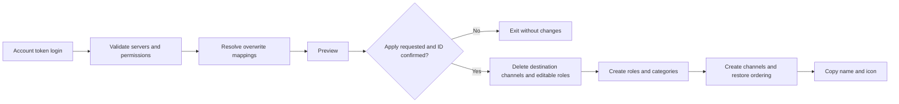
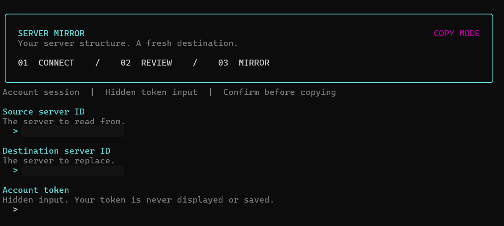
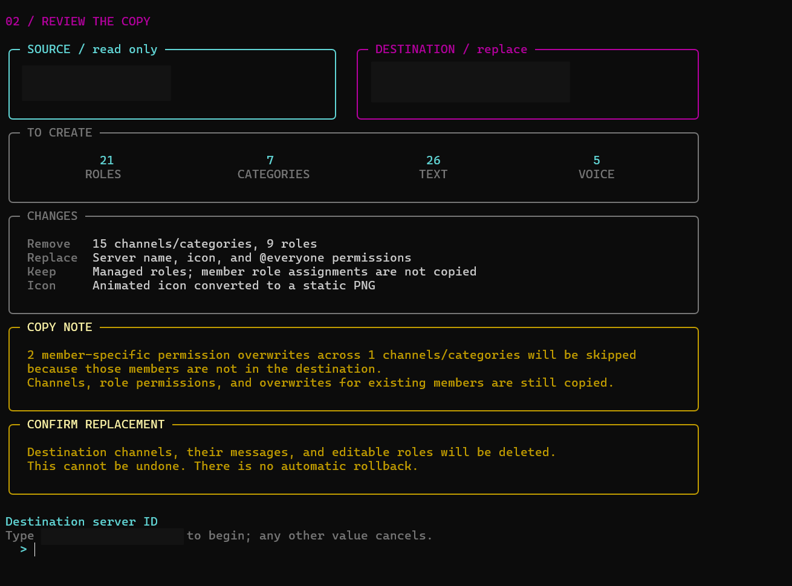
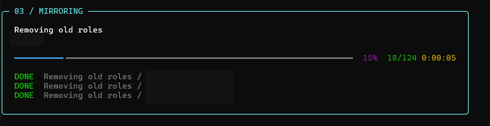
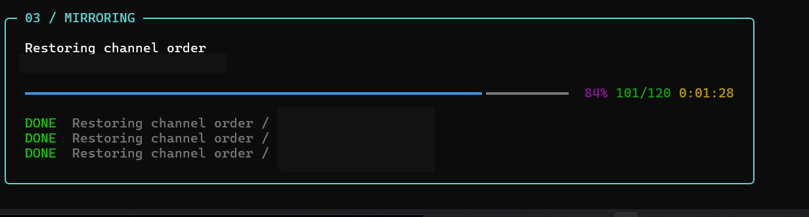
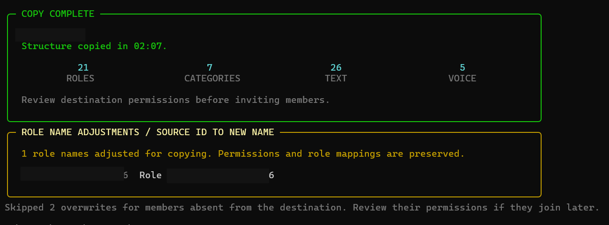
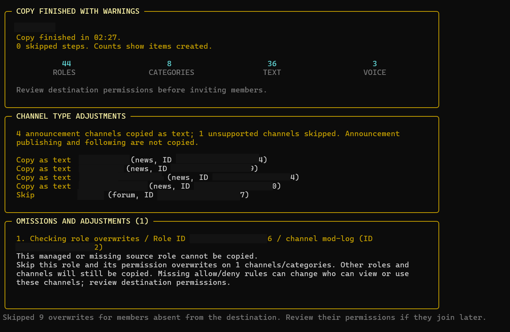

# Server Mirror

**Copy the structure of a Discord server with a clear preview and an explicit confirmation.**


Server Mirror is a small Python command-line tool for recreating roles, categories, and standard text and voice channels in another Discord server. It signs in with **your Discord account token** using [discord.py-self](https://pypi.org/project/discord.py-self/) and checks access and permission mappings before changing the destination. No bot application or bot invitation is required.

> [!WARNING]
> Applying a copy **deletes all existing destination channels and their message history, and replaces editable roles**. There is no undo or automatic rollback. Use a fresh, disposable destination server first. Existing members lose assignments to deleted roles.

[Setup](#setup) · [Usage](#usage) · [Screenshots](#screenshots) · [What gets copied](#what-gets-copied) · [Troubleshooting](docs/TROUBLESHOOTING.md) · [Contributing](.github/CONTRIBUTING.md) · [Changelog](CHANGELOG.md)

## What gets copied

| Item | Behavior |
| --- | --- |
| Server identity | Copies the name and icon; uses a static PNG if animated icons are unavailable; clears the icon if the source has none |
| Roles | Copies names, permissions, primary colors, hoist, mentionability, and relative order |
| Default role | Copies `@everyone` permissions |
| Categories | Copies names, order, and permission overwrites |
| Text channels | Copies names, categories, order, topics, NSFW flags, slowmode, and thread defaults |
| Announcement channels | Creates standard text channels with the same name, category, order, topic, permissions, and compatible text settings; publishing and following are not copied |
| Voice channels | Copies names, categories, order, NSFW flags, slowmode, user limits, region, video quality, and bitrate within destination limits |
| Other channel types | Skips forum, media, stage, and unrecognized types; lists omissions in the preview and completion summary |
| Permission overwrites | Maps roles by ID; copies individual overwrites for destination members and reports skipped overwrites for absent members |
| Managed roles | Preserves destination bot and integration roles; does not copy source managed roles |
| Account access role | If you do not own the destination, preserves your highest Administrator role |

Role names are checked before copying: empty or invisible-only names become `Role <source ID>`, control characters and outer whitespace are removed, and names longer than 100 characters are shortened. Adjustments are shown in the preview and completion summary. If Discord still rejects only a role name's length, that role is retried once with `Role <source ID>` and reported on completion. Permissions and ID-based overwrite mappings are preserved.

Messages, threads, members, member role assignments, emojis, stickers, webhooks, invites, bans, integrations, role icons/gradients, and other server settings are **not copied**. This is a structure copier, not a backup or a continuous synchronization service.

Announcement channels are converted to standard text channels. Forum, media, stage, and unrecognized channel types are skipped before permission validation, so their presence does not stop the copy. Skipped channels are excluded from creation totals and progress; their categories may still be copied. Conversions and omissions are reported before confirmation and on completion.

Overwrites referring to managed or missing source roles are now recoverable. In copy mode, the tool explains which role and how many channel/category overwrites are affected and asks **`Continue? [y/N]`**. Accepting skips those overwrites while preserving all other mappings. The decision covers that role across the copy. Missing allow/deny rules can change channel access; review the reported omissions. Preview mode lists these proposed omissions without prompting or changing either server.

When a member is absent from the destination, only that person's channel/category overwrites are skipped; the channels and remaining permissions are still copied. The preview and completion summary report these omissions. If that person joins later, review their permissions because their original individual rules were not copied. The destination must have Community disabled.

## Setup

### 1. Install Python and dependencies

Use Python **3.10 or newer**. Download or clone this repository, open a terminal in its directory, and create a virtual environment.

**Windows PowerShell**

```powershell
py -m venv .venv
.\.venv\Scripts\python.exe -m pip install -r requirements/runtime.txt
```

**Linux / macOS**

```bash
python3 -m venv .venv
.venv/bin/python -m pip install -r requirements/runtime.txt
source .venv/bin/activate
```

On Windows, use `.\.venv\Scripts\python.exe` wherever the commands below say `python`, or activate the environment first.

If you previously installed the bot-token version, replace its conflicting library in the same virtual environment:

```bash
python -m pip uninstall -y discord discord.py discord.py-self
python -m pip install -r requirements/runtime.txt
```

Do not install `discord.py` alongside `discord.py-self`: both provide the `discord` import namespace.

### 2. Prepare your account and servers

1. Use your own Discord account, with membership in both servers.
2. The **source** requires membership, not Administrator or Manage Server. The tool uses every channel/category supplied by Discord and all ordinary source roles, including roles you do not hold. It does not filter channels by your `View Channel` permission: hidden channels are included when their metadata is supplied by Discord. The **destination** requires Administrator or ownership because its structure is modified.
3. If you own the destination, no separate access role is required. Otherwise, your highest role must grant Administrator and be above every other ordinary role. The tool preserves that role while replacing the others.
4. Enable Developer Mode in Discord and use **Copy Server ID** for the source and destination.
5. Enter your **account token** at the hidden prompt when you run the tool, or supply `DISCORD_USER_TOKEN` in the process environment.

Use servers you own or are authorized to manage. There are no bot scopes or gateway intent settings to configure.

Channel metadata and access to channel contents are separate. Copying a hidden channel's
available structure does not read its messages or grant access in the source. If Discord
omits or redacts channel metadata, the missing names/settings cannot be reconstructed.
See Discord's [channel obfuscation announcement](https://docs.discord.com/developers/change-log#channel-obfuscation-for-users-and-bots).

> [!IMPORTANT]
> This project uses the account API through `discord.py-self`, an unofficial library. The current client accepts account tokens directly; do not add the old `bot=False` argument or downgrade to discord.py 1.7.3.

## Usage

### Terminal interface

The terminal includes source and destination cards, a copy summary, and a live progress
panel with completed steps, elapsed time, and the latest role/channel names. Success,
cancellation, and errors have separate status panels. Narrow windows stack server cards
vertically; redirected output uses concise phase messages without animation.

Preview the interface with sample data, without logging in or changing a server:

```powershell
.\start.bat --demo
```

On any platform, you can also use `python -m server_mirror --demo`. Run
`python -m pip install -r requirements/runtime.txt` after updating to install the terminal dependency.
Colors follow your terminal's capabilities and respect `NO_COLOR`.

### Preview first

```bash
python -m server_mirror --source 111111111111111111 --target 222222222222222222
```

Replace the example IDs with your own. Missing IDs are prompted interactively. The token is requested through hidden terminal input, unless `DISCORD_USER_TOKEN` is already set in the process environment.

A successful preview checks prerequisites, resolves member overwrites, reads the source icon, and displays the planned deletions and creations. **It makes no server changes.** It still needs a valid account token and an internet connection.

If Discord rejects an individual request during copying, a recovery panel shows the operation, item, rejected fields, and the effect of continuing. Enter `y`, `yes`, `e`, or `evet` to accept; `n`, `no`, `h`, `hayir`, `hayır`, or Enter stops. Invalid answers prompt again. Each new failure needs its own decision; there is no automatic blanket approval. Structured field errors are shown without printing raw API responses or submitted values. See [Troubleshooting](docs/TROUBLESHOOTING.md) for interpreting these errors.

### Recoverable failures

| Failure | Effect of choosing to continue |
| --- | --- |
| Delete a destination role/channel | Leave that item in place; old permissions and duplicate names may remain |
| Create a role or copy its permissions | Skip the role and its channel/category overwrites; copy the remaining roles |
| Update `@everyone` | Keep the destination's existing default permissions and continue |
| Create a category / missing category | Create its children without a category, with their own available overwrites |
| Create a text/voice channel or copy its overwrites | Skip that channel and its ordering step; continue with other channels |
| Restore role/channel/category order | Keep current ordering (and current slowmode if the combined channel edit failed) |
| Read the source icon | Keep the destination icon; still copy the name and structure |
| Update the server name/icon | Keep the copied structure and omit the rejected identity update |
| Resolve a member's overwrites | Skip that member's overwrites, with an explicit warning that their access may differ |
| Exceed role capacity during preparation | Copy the roles that fit, in source hierarchy order; list and skip excess roles and their overwrites |

Permissions are never silently stripped from a rejected role/channel creation request. You can accept skipping that item. Known unmappable overwrites have their own explicit omission decision. The existing role-name fallback, announcement-to-text conversion, and bitrate adjustment remain available.

Progress distinguishes `SKIP` from `DONE`; the bar measures processed steps, including skips. The final panel says **COPY FINISHED WITH WARNINGS** for omissions, reports actual created counts, and repeats the omission details. Declining a recovery or ending input stops further requests; earlier changes remain.

### Apply the copy

```bash
python -m server_mirror --source 111111111111111111 --target 222222222222222222 --apply
```

After validation and the preview, type the **destination server ID** to confirm. Any other response cancels. Keep both servers unchanged while the operation runs.

On Windows, `start.bat` uses the project's virtual environment and forwards arguments:

```powershell
.\start.bat --source 111111111111111111 --target 222222222222222222 --apply
```

### How it works



Requests run sequentially through `discord.py-self`. Individual request rejections can be skipped with the confirmation described above. Invalid server selection, missing membership/Administrator access, unsafe destination hierarchy, Community prerequisites, authentication/account verification, lost server access, rate-limit failures that escape the library, server failures, uncertain write/connection failures, and unexpected programming errors still stop the operation. These are not automatically retried or treated as successful writes. A repeated READY event cannot run the copy twice, and the tool does not automatically reconnect and replay a failed copy.

| Exit code | Meaning |
| --- | --- |
| `0` | Preview completed, or copy completed without omissions |
| `1` | Validation, authentication, connection, or copy failed |
| `2` | Invalid command-line arguments, confirmation did not match, or recovery declined |
| `3` | Copy finished with omissions/warnings; review the final report |
| `130` | Interrupted or interactive input ended |

A failed operation may leave a partially modified destination. Review it before retrying. Discord limits, server features, network problems, and concurrent changes can still cause an API request to fail after validation.

## Screenshots

These examples show the copy flow from connection to completion, including a separate run that finished with warnings.

### 1. Connect

Enter the source and destination server IDs, then provide the account token through hidden input.



### 2. Review and confirm

Review the planned changes, copy notes, and replacement warning before confirming the destination server ID.



### 3. Remove old roles

The live panel shows the current operation, completed steps, progress, and elapsed time.



### 4. Restore channel order

Progress continues as the copied channels are placed in their source order.



### 5. Copy complete

The completion report shows created item counts, role-name adjustments, and notes about member overwrites.



### 6. Copy finished with warnings

A separate example shows channel-type conversions, skipped channels, and omitted role permission overwrites for review.



## Token handling

- Enter your account token at the hidden prompt, or provide `DISCORD_USER_TOKEN` through your process environment or secret manager.
- The application does not write the token to a file or offer a token command-line argument.
- Hidden input must be available; the tool refuses a fallback that would echo the token.
- `.env` files are ignored by Git, but **are not loaded automatically**.
- Never paste tokens into source code, issues, screenshots, or shell commands that will be saved to history.
- Treat an account token as a password. If exposed, secure your account and revoke compromised sessions through Discord's account settings. Removing a file does not revoke a token or remove it from Git history.

## Development

```bash
python -m pip install -r requirements/dev.txt
python -m ruff check .
python -m ruff format --check .
python -m unittest discover -s tests -v
python -m pip_audit -r requirements/runtime.txt
```

Tests use mocked Discord objects and perform no Discord API calls. CI checks Python 3.10 through 3.14 on Linux and Python 3.14 on Windows. GitHub Actions also runs dependency auditing, and Dependabot checks pip dependencies and action versions.

```text
server_mirror/              Application package
  __main__.py              Module launcher: python -m server_mirror
  cli.py                   Arguments, credentials, connection, and confirmation
  core/                    Copy logic and error handling
    clone.py               Validation, ID mappings, and sequential operations
    recovery.py            Recovery decisions and critical-error classification
    discord_errors.py      Safe Discord error formatting
  ui/
    terminal.py            Terminal panels, live progress, and offline demo
requirements/
  runtime.txt              Runtime dependencies
  dev.txt                  Runtime dependencies plus development and audit tools
tests/                     Offline regression tests
docs/                      Troubleshooting and README screenshots
.github/                   CI, dependency updates, issue templates, and policies
start.bat                  Windows launcher using the local virtual environment
pyproject.toml             Lint and formatting configuration
README.md                  Setup and usage
CHANGELOG.md               Release history
```

Run module and development commands from the repository root. The Windows launcher
selects that directory automatically, including when called from another folder.
Keep the entire `server_mirror` package together; its modules use package imports.

For support, see [the troubleshooting guide](docs/TROUBLESHOOTING.md) and [support policy](.github/SUPPORT.md). Report sensitive security issues using [the security policy](.github/SECURITY.md).